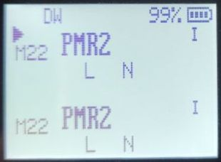
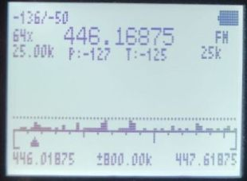
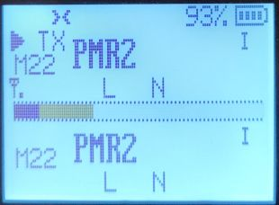
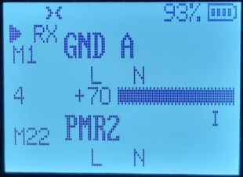

# Main features:
* many of OneOfEleven mods:
   * AM fix, huge improvement in reception quality
   * longpress buttons functions replicating F+ action
   * fast scanning
   * channel name editing in the menu
   * channel name + frequency display option
   * shortcut for scannlist assignment (longpress `5 NOAA`)
   * scannlist toggle (longpress `* SCANN` while scanning)
   * configurable button function selectable from menu
   * battery percantage/voltage on status bar, selectable from menu
   * longer backlight times
   * mic bar
   * RSSI s-meter
   * more frequency steps
   * squelch more sensitive
* fagci spectrum analyzer (**F+5** to turn on)
* some other mods introduced by me:
   * SSB demodulation (adopted from fagci)
   * backlight dimming
   * battery voltage callibration from menu
   * better battery percantage calculation, selectable for 1600mAh or 2200mAh
   * more configurable button functions
   * longpress MENU as another cofigurable button
   * better DCS/CTCSS scanning in the menu (`* SCAN` while in RX DCS/CTCSS menu item)
   * Piotr022 s-meter style
   * restore initial freq/channel when scanning stopped with EXIT, remember last found transmission with MENU button
   * reordered and renamed menu entries
   * LCD interference crash fix

 # Manual

* [Radio operation](https://github.com/egzumer/uv-k5-firmware-custom/wiki/Radio-operation)

* [Menu](https://github.com/egzumer/uv-k5-firmware-custom/wiki/Menu)

* [Button functions](https://github.com/egzumer/uv-k5-firmware-custom/wiki/Button-functions)

* [Spectrum analyzer](https://github.com/egzumer/uv-k5-firmware-custom/wiki/Spectrum-analyzer)

* [Flashing the firmware](https://github.com/egzumer/uv-k5-firmware-custom/wiki/Flashing-the-firmware)




# Open reimplementation of the Quan Sheng UV-K5 v2.1.27 firmware

This repository is a merge of OneOfEleven custom firmware with fagci spectrum analizer plus my few changes.

https://github.com/OneOfEleven/uv-k5-firmware-custom<br>
https://github.com/fagci/uv-k5-firmware-fagci-mod/tree/refactor

All is a cloned and customized version of DualTachyon's open firmware found here ..

https://github.com/DualTachyon/uv-k5-firmware .. a cool achievement !

Use this firmware at your own risk (entirely). There is absolutely no guarantee that it will work in any way shape or form on your radio(s), it may even brick your radio(s), in which case, you'd need to buy another radio.
Anyway, have fun.

# Radio performance

Please note that the Quansheng UV-Kx radios are not professional quality transceivers, their
performance is strictly limited. The RX front end has no track-tuned band pass filtering
at all, and so are wide band/wide open to any and all signals over a large frequency range.

Using the radio in high intensity RF environments will most likely make reception anything but
easy (AM mode will suffer far more than FM ever will), the receiver simply doesn't have a
great dynamic range, which results in distorted AM audio with stronger RX'ed signals.
There is nothing more anyone can do in firmware/software to improve that, once the RX gain
adjustment I do (AM fix) reaches the hardwares limit, your AM RX audio will be all but
non-existant (just like Quansheng's firmware).
On the other hand, FM RX audio will/should be fine.

But, they are nice toys for the price, fun to play with.

# User customization

You can customize the firmware by enabling/disabling various compile options, this allows
us to remove certain firmware features in order to make room in the flash for others.
You'll find the options at the top of "Makefile" ('0' = disable, '1' = enable) ..

```
ENABLE_CLANG                  := 0     **experimental, builds with clang instead of gcc (LTO will be disabled if you enable this)
ENABLE_SWD                    := 0       only needed if using CPU's SWD port (debugging/programming)
ENABLE_OVERLAY                := 0       cpu FLASH stuff, not needed
ENABLE_LTO                    := 0     **experimental, reduces size of compiled firmware but might break EEPROM reads (OVERLAY will be disabled if you enable this)
ENABLE_UART                   := 1       without this you can't configure radio via PC !
ENABLE_AIRCOPY                := 0       easier to just enter frequency with butts
ENABLE_FMRADIO                := 0       WBFM VHF broadcast band receiver
ENABLE_NOAA                   := 0       everything NOAA (only of any use in the USA)
ENABLE_VOICE                  := 0       want to hear voices ?
ENABLE_VOX                    := 0
ENABLE_ALARM                  := 0       TX alarms
ENABLE_1750HZ                 := 0       side key 1750Hz TX tone (older style repeater access)
ENABLE_PWRON_PASSWORD         := 1       power-on password stuff
ENABLE_BIG_FREQ               := 0       big font frequencies (like original QS firmware)
ENABLE_SMALL_BOLD             := 1       bold channel name/no. (when name + freq channel display mode)
ENABLE_KEEP_MEM_NAME          := 1       maintain channel name when (re)saving memory channel
ENABLE_WIDE_RX                := 1       full 18MHz to 1300MHz RX (though front-end/PA not designed for full range)
ENABLE_TX_WHEN_AM             := 0       allow TX (always FM) when RX is set to AM
ENABLE_F_CAL_MENU             := 0       enable the radios hidden frequency calibration menu
ENABLE_CTCSS_TAIL_PHASE_SHIFT := 1       standard CTCSS tail phase shift rather than QS's own 55Hz tone method
ENABLE_BOOT_BEEPS             := 0       gives user audio feedback on volume knob position at boot-up
ENABLE_SHOW_CHARGE_LEVEL      := 0       show the charge level when the radio is on charge
ENABLE_REVERSE_BAT_SYMBOL     := 1       mirror the battery symbol on the status bar (+ pole on the right)
ENABLE_NO_CODE_SCAN_TIMEOUT   := 1       disable 32-sec CTCSS/DCS scan timeout (press exit butt instead of time-out to end scan)
ENABLE_AM_FIX                 := 1       dynamically adjust the front end gains when in AM mode to helo prevent AM demodulator saturation, ignore the on-screen RSSI level (for now)
ENABLE_AM_FIX_SHOW_DATA       := 1       show debug data for the AM fix (still tweaking it)
ENABLE_SQUELCH_MORE_SENSITIVE := 0       make squelch levels a little bit more sensitive - I plan to let user adjust the values themselves
ENABLE_FASTER_CHANNEL_SCAN    := 0       increases the channel scan speed, but the squelch is also made more twitchy
ENABLE_RSSI_BAR               := 1       enable a dBm/Sn RSSI bar graph level inplace of the little antenna symbols
ENABLE_AUDIO_BAR              := 0       experimental, display an audio bar level when TX'ing
ENABLE_COPY_CHAN_TO_VFO       := 1       copy current channel into the other VFO. Long press `1 BAND` when in channel mode
ENABLE_SPECTRUM               := 1       fagci spectrum analizer, activated with `F` + `5 NOAA`
ENABLE_REDUCE_LOW_MID_TX_POWER:= 0       makes medium and low power settings even lower
ENABLE_BYP_RAW_DEMODULATORS   := 0       additional BYP (bypass?) and RAW demodulation options, prooved not to be very usefull, but it is there if you want to experiment
ENABLE_BLMIN_TMP_OFF		  := 0       additional function for configurable buttons that toggles `BLMin` on and off wihout saving it to the EEPROM
```


# Compiler

arm-none-eabi GCC version 10.3.1 is recommended, which is the current version on Ubuntu 22.04.03 LTS.
Other versions may generate a flash file that is too big.
You can get an appropriate version from: https://developer.arm.com/downloads/-/gnu-rm

clang may be used but isn't fully supported. Resulting binaries may also be bigger.
You can get it from: https://releases.llvm.org/download.html

# Building

If you have docker installed you can use `compile-with-docker.bat`, the output files are created in `compiled-firmware` folder. This method gives significantly smaller binaries, I've seen differences up to 1kb, so it can fit more functionalities this way. The challange can be (or not) installing the docker itself.


To compile directly in windows:

1. Open windows command line and run:
    ```
    winget install -e -h git.git Python.Python.3.8 GnuWin32.Make
    winget install -e -h Arm.GnuArmEmbeddedToolchain -v "10 2021.10"
    ```
2. Close command line, open a new one and run:
    ```
    pip install --user --upgrade pip
    pip install crcmod
    mkdir c:\projects & cd /D c:/projects
    git clone https://github.com/egzumer/uv-k5-firmware-custom.git
    ```
3. From now on you can build the firmware by going to `c:\projects\uv-k5-firmware-custom` and running `win_make.bat` or by running a command line:
    ```
    cd /D c:\projects\uv-k5-firmware-custom
    win_make.bat
    ```
4. To reset the repository and pull new changes run (!!! it will delete all your changes !!!):
    ```
    cd /D c:\projects\uv-k5-firmware-custom
    git reset --hard & git clean -fd & git pull
    ```

I've left some notes in the win_make.bat file to maybe help with stuff.

# Credits

Many thanks to various people on Telegram for putting up with me during this effort and helping:

* [OneOfEleven](https://github.com/OneOfEleven)
* [DualTachyon](https://github.com/DualTachyon)
* [Mikhail](https://github.com/fagci)
* [Andrej](https://github.com/Tunas1337)
* [Manuel](https://github.com/manujedi)
* @wagner
* @Lohtse Shar
* [@Matoz](https://github.com/spm81)
* @Davide
* @Ismo OH2FTG
* [OneOfEleven](https://github.com/OneOfEleven)
* @d1ced95
* and others I forget

# License

Copyright 2023 Dual Tachyon
https://github.com/DualTachyon

Licensed under the Apache License, Version 2.0 (the "License");
you may not use this file except in compliance with the License.
You may obtain a copy of the License at

    http://www.apache.org/licenses/LICENSE-2.0

    Unless required by applicable law or agreed to in writing, software
    distributed under the License is distributed on an "AS IS" BASIS,
    WITHOUT WARRANTIES OR CONDITIONS OF ANY KIND, either express or implied.
    See the License for the specific language governing permissions and
    limitations under the License.

# Example changes/updates

<p float="left">
  
  
  
</p>

Video showing the AM fix working ..

<video src="/images/AM_fix.mp4"></video>

<video src="https://github.com/OneOfEleven/uv-k5-firmware-custom/assets/51590168/2a3a9cdc-97da-4966-bf0d-1ce6ad09779c"></video>
